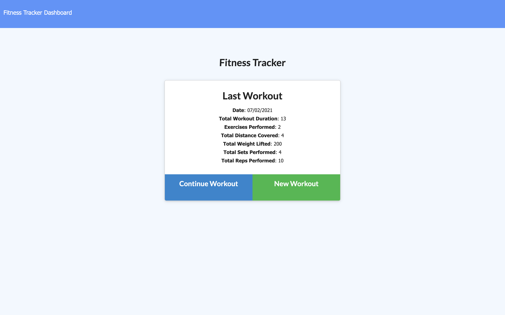
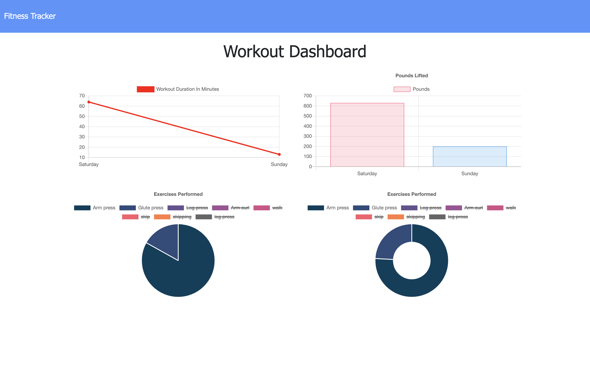

 

# MyFit - The Daily Workout Tracker

## Description
For this project I was tasked with creating a workout tracker using a Mongo database with a Mongoose schema and Express. The front end code in the `Develop` folder was already provided.

The application allows the user to
  * Add exercises to the most recent workout plan
  * Add new exercises to a new workout plan
  * View the combined weight of multiple exercises from the past seven workouts on the `stats` page
  * View the total duration of each workout from the past seven workouts on the `stats` page

### User Story

> As a **user**, I want to **be able to view create and track daily workouts. I want to be able to log multiple exercises in a workout on a given day. I should also be able to track the name, type, weight, sets, reps, and duration of exercise. If the exercise is a cardio exercise, I should be able to track my distance traveled.**.

## Table of Contents
- [Preview](#Preview)
- [Execute](#Execute)
- [Contributing](#Contributing)
- [License](#License)
- [Environment](#Environment)
- [Questions](#Questions)

## Preview

> Visit the deployed application on [Heroku](https://myfittrackerapp.herokuapp.com/stats).

#### Homepage page

#### Stats page

## Execute
Clone the repo and in the command line run `npm install` or shortcut `npm i` to download all the npm package dependancies which include: Node Express and Mongoose.

Then invoke the application with command `node server.js` or by using the nodemon script `npm run dev`.

## Contributing
Contributions are welcomed.

## License
MIT

## Environment
* [Visual Studio Code](https://code.visualstudio.com/)
* [Git](https://git-scm.com/book/en/v2/Getting-Started-Installing-Git)
* [Node.js](https://nodejs.org/en/)
* [NPM](https://www.npmjs.com/)
* [Express](https://www.npmjs.com/package/express)
* [Postman](https://www.postman.com/)
* [Heroku](https://www.heroku.com/)
* [Robo3T](https://robomongo.org/)
* [MongDb Atlas](https://www.mongodb.com/cloud/atlas)
* [Mongoose](https://mongoosejs.com/)
